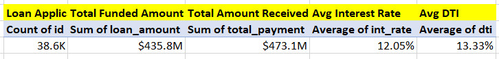
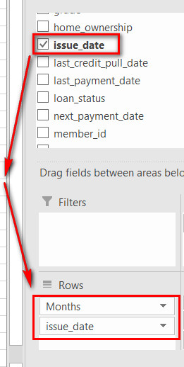
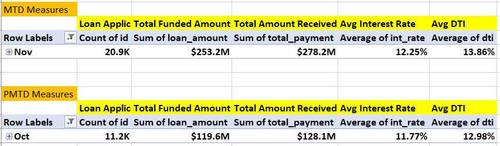
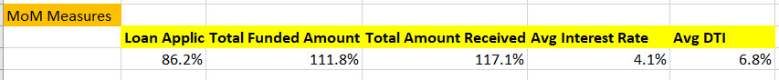
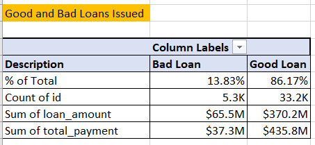
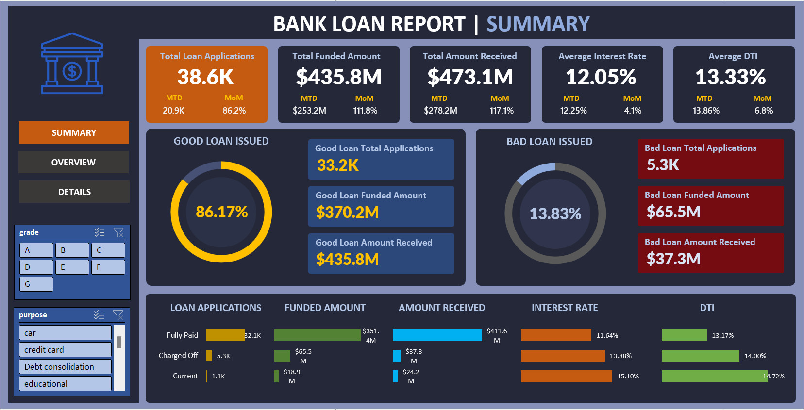
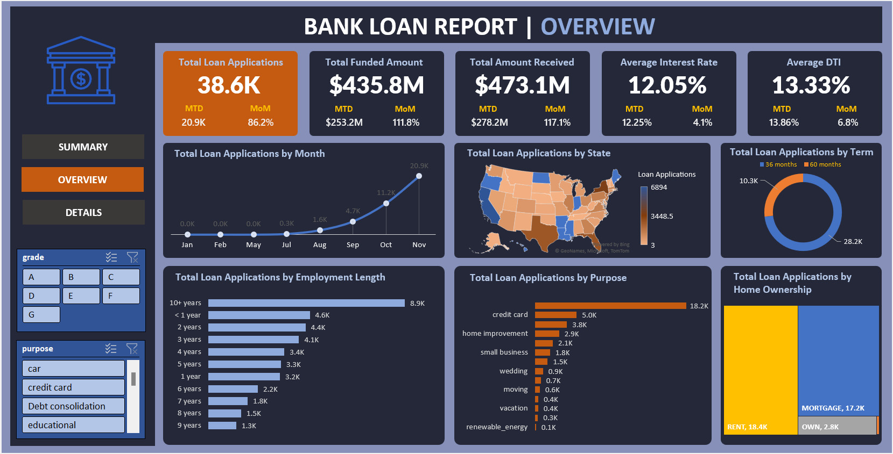
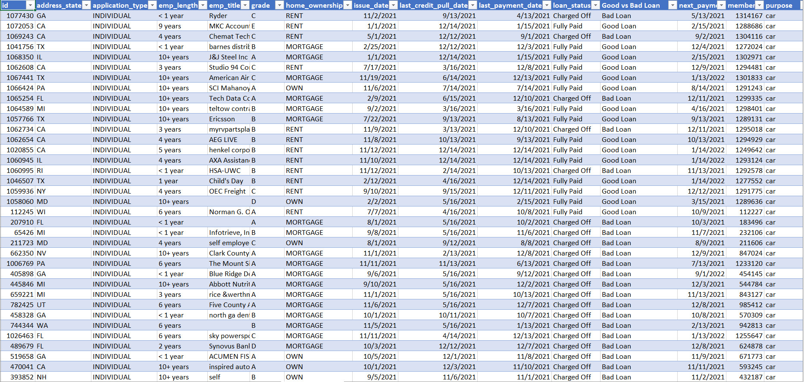

# Bank Loan Analysis using Microsoft Excel


## Introduction
This analysis is basically to practise my data analytics and visualization skills using Excel, and the main aim is to solve the business problems involved. The Bank Loan Report aims to provide a comprehensive analysis of key loan-related metrics to monitor and assess the lending activities and performance of Virtue Bank, an imaginary bank. By leveraging data-driven insights, the report will facilitate informed decision-making, portfolio health tracking, and identification of trends to refine lending strategies.

The Dashboard contains 3 key Pages which are:
- Summary
- Overview
- Details

## Problem Statement

The bank needs to evaluate its lending activities and performance to ensure profitability, minimize risk exposure, and maintain a healthy loan portfolio. 

## Dashboard 1: Summary

### Key Questions Explored

**Key Performance Indicators (KPIs) Requirements:**

1. How many loan applications were received during the specified period, and how do the Month-to-Date (MTD) loan applications compare, with a focus on tracking Month-over-Month (MoM) changes?

2. What is the total amount disbursed as loans, and how does the Month-to-Date (MTD) Total Funded Amount compare, with an analysis of Month-over-Month (MoM) changes?

3. What is the total amount received from borrowers, and how does the Month-to-Date (MTD) Total Amount Received compare, with an analysis of Month-over-Month (MoM) changes?

4. What is the average interest rate across all loans, and how do the Month-to-Date (MTD) variations compare, focusing on tracking Month-over-Month (MoM) changes?

5. What is the average Debt-to-Income Ratio (DTI) for the borrowers, and how do the Month-to-Date (MTD) averages compare, with an analysis of Month-over-Month (MoM) fluctuations?

**_Good Loan v Bad Loan KPIs_**

_To assess the effectiveness of our lending operations and evaluate the quality of our loan portfolio, it is imperative to develop an extensive report that distinguishes between 'Good Loans' and 'Bad Loans' according specific criteria for loan status._

**Good Loan KPIs:**

1. What is the percentage of loan applications categorized as 'Good Loans,' comprising loans with a status of 'Fully Paid' and 'Current'?

2. How many loan applications fall into the category of 'Good Loans,' specifically including loans with a status of 'Fully Paid' and 'Current'?

3. What is the total amount disbursed as 'Good Loans,' encompassing the principal amounts of loans with a status of 'Fully Paid' and 'Current'?

4. How much total amount has been received from borrowers for 'Good Loans,' covering all payments made on loans with a status of 'Fully Paid' and 'Current'?

**Bad Loan KPIs:**

1. What is the percentage of loan applications classified as 'Bad Loans,' specifically encompassing loans with a status of 'Charged Off'?

2. How many loan applications are categorized as 'Bad Loans,' specifically including loans with a status of 'Charged Off'?

3. What is the total amount disbursed as 'Bad Loans,' comprising the principal amounts of loans with a status of 'Charged Off'?

4. How much total amount has been received from borrowers for 'Bad Loans,' covering all payments made on loans with a status of 'Charged Off'?

### Loan Status Grid View

To obtain a comprehensive overview of our lending operations and effectively monitor loan performance, our objective is to generate a grid view report classified by 'Loan Status.' This report will serve as a valuable analytical tool for understanding the key indicators associated with various loan statuses. 

By offering insights into metrics such as 'Total Loan Applications,' 'Total Funded Amount,' 'Total Amount Received,' 'Month-to-Date (MTD) Funded Amount,' 'MTD Amount Received,' 'Average Interest Rate,' and 'Average Debt-to-Income Ratio (DTI),' this grid view will enable us to make informed decisions based on data and evaluate the health of our loan portfolio.

***

## Dashboard 2: Overview

In this report, our goal is to visually depict essential loan-related metrics and trends through a diverse range of chart formats. These charts will offer a clear and informative perspective on the Bank's lending activities, empowering data-driven decision-making and allowing Virtue Bank to glean valuable insights into different loan parameters.

**_Below are the specific chart requirements:_**

**1. Monthly Trends by Issue Date (Line Chart):**

- Chart Type: Line Chart

- Metrics: 'Total Loan Applications,' 'Total Funded Amount,' and 'Total Amount Received'

- X-Axis: Month (based on 'Issue Date')

- Y-Axis: Metrics' Values

_Objective: This line chart will showcase how 'Total Loan Applications,' 'Total Funded Amount,' and 'Total Amount Received' vary over time, allowing us to identify seasonality and long-term trends in lending activities._

**2. Regional Analysis by State (Filled Map):**

- Chart Type: Filled Map

- Metrics: 'Total Loan Applications,' 'Total Funded Amount,' and 'Total Amount Received'

- Geographic Regions: States

_Objective: This filled map will visually illustrate lending metrics categorized by state, allowing us to pinpoint areas with notable lending activity and evaluate regional discrepancies._

**3. Loan Term Analysis (Donut Chart):**

- Chart Type: Donut Chart

- Metrics: 'Total Loan Applications,' 'Total Funded Amount,' and 'Total Amount Received'

- Segments: Loan Terms (e.g., 36 months, 60 months)

_Objective: This donut chart will represent loan statistics based on different loan terms, enabling us to understand the distribution of loans across various term lengths._

**4. Employment Length Analysis (Bar Chart):**

- Chart Type: Bar Chart

- Metrics: 'Total Loan Applications,' 'Total Funded Amount,' and 'Total Amount Received'

- X-Axis: Employment Length Categories (e.g., 1 year, 5 years, 10+ years)

- Y-Axis: Metrics' Values

_Objective: This bar chart will demonstrate the distribution of lending metrics across borrowers with varying lengths of employment, aiding in our evaluation of the impact of employment history on loan applications._

**5. Loan Purpose Breakdown (Bar Chart):**

- Chart Type: Bar Chart

- Metrics: 'Total Loan Applications,' 'Total Funded Amount,' and 'Total Amount Received'

- X-Axis: Loan Purpose Categories (e.g., debt consolidation, credit card refinancing)

- Y-Axis: Metrics' Values

_Objective: This bar chart will visually depict loan metrics categorized by the stated purposes of loans, assisting in comprehending the main motivations driving borrowers to seek financing._

**6. Home Ownership Analysis (Tree Map):**

- Chart Type: Tree Map

- Metrics: 'Total Loan Applications,' 'Total Funded Amount,' and 'Total Amount Received'

- Hierarchy: Home Ownership Categories (e.g., own, rent, mortgage)

_Objective: This tree map will present loan metrics sorted by diverse home ownership statuses, providing a hierarchical view of the influence of home ownership on both loan applications and disbursements._

***

## Dashboard 3: Details

Virtue Bank acknowledges the necessity for a comprehensive 'Details Dashboard' that presents a unified perspective of all crucial information contained within the Bank's loan data. This Details Dashboard seeks to provide a holistic overview of vital loan-related metrics and data points, allowing users' efficient access to essential information.

**_Objective:_**
_The primary objective of the Details Dashboard is to provide a comprehensive and user-friendly interface for accessing vital loan data. It will serve as a one-stop solution for users seeking detailed insights into the Bank’s loan portfolio, borrower profiles, and loan performance._

***

## Data Sourcing

I came across the data online and saved locally on my PC in CSV format. Considering how rich the data was, I decided to implement my analytics and visualization skill on the dataset using Excel. The dataset is a single Excel workbook containing 1 table or worksheet by name; ` bank_loan_data`. The table contained 24 columns and 38,575 rows.

## Data Cleaning & Transformation

I performed thorough data cleaning in the Power Query tool of Excel. The processes include:
- Checking for null values
- Validating data types
- Checking for duplicates in the distinct columns

## Exploratory Data Analysis (EDA)

Exploratory data analysis was performed using the 'Pivot Table' in Excel. The analysis was conducted to answer all the underlined key business questions and use-cases under the 3 different Dashboards (Reports); Summary, Overview, and Details, respectively.

### Calculating KPI Measures

I first calculated the following:
- **Total loan applications:** The total count of loan applications. 
- **Total Funded Amount:** The total amount disbursed as loans. 
- **Total Amount Received:** The total amount of repayments received from borrowers.
- **Average Interest Rate:** The average interest rate across all loans.
- **Average DTI:** The average Debt-to-Income Ratio for the borrowers.



I also developed the Month-to-Date (MTD) and Previous-Month-to-Date (PMTD) measures by first adding the `issue_date` column into the 'Rows' field of the 'PivotTable Fields', then, I filtered the current month (November) against the previous month (October).

###### _Dragging of `issue_date` column into ‘Rows’ field_



###### _MTD and PMTD measures_



I also calculated the Month-over-Month (MoM) metrics to assess the percentage variation by comparing the Month-to-Date (MTD) against the Previous Month-to-Date (PMTD).

Below is the formula I used: 
```
MOM = (MTD - PMTD) / PMTD
```
The output: 



### Good Loan vs Bad Loan

I also calculated the value for 'Good loans' and 'bad loans'. There wasn't any column indicating ‘Good Loan’ or ‘Bad Loan’ so, firstly, I had to develop a measure using the `IF()` function to extract good or bad loans from the 'loan_status' column. The criteria for this measure indicate 'Good Loan' to be loan with the status as 'Fully Paid' or 'Current' while loan with the status as 'Charged Off' represents 'Bad Loan'.

Formula used:

```
=IF(OR([@[loan_status]]="Fully Paid",[@[loan_status]]="Current"),"Good Loan",IF([@[loan_status]]="Charged Off","Bad Loan",""))
```



Further analysis could be derived from the Visuals as well as the PivotTable from the Dataset labeled ` Analysis_and_Visuals_Dataset_BankLoan.xlsx`

***

## Data Visualization

### Summary Page



### Overview Page



### Details Page



[Click here](https://github.com/gmozu/Bank-Loan-Analysis-with-Excel/blob/main/Analysis_and_Visuals_Dataset_BankLoan.xlsx) to download and interact with the report.

***

###### Thank you for taking your time to review this project. Your comments or suggestions are humbly welcomed.
